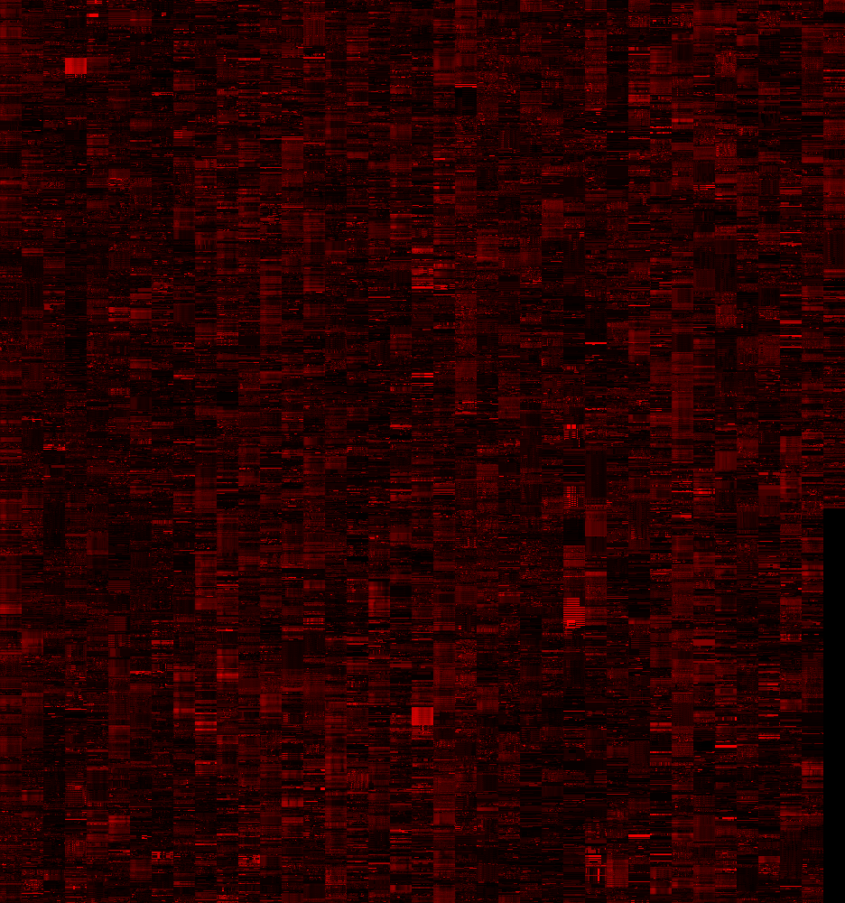

# OpenTraffic

## Log

### 1. Digesting the CSV

1. Do an export on the website
2. unzip it inside `data/` folder
3. Open [`script/export_digest.py`](script/export_digest.py) and change line 9 to match the name of the export
4. Run [`script/export_digest.py`](script/export_digest.py)

**Note**: Because the data set could be VERY BIG, this script splits the sanitize data accross multiple CSV files. You can adjust with `SAMPLES_PER_FILE` at line 12.

#### 1.a CSV files handles time in an awekard way

`Edge Id,Date Start,Date End,Monday,Tuesday,Wednesday,Thursday,Friday,Saturday,Sunday,Time Start,Time End,...`
`1000001163,05/25/2015,10/02/2016,1,0,0,0,0,0,0,10:00,010:59`

To have a consisten timestamp I'm taking the `Date Start` and offset it by that day of the week 

```python
    # Calculate the timestamp from the "Date Start" ...
    timestamp = datetime.strptime(row[1]+' '+row[10],'%m/%d/%Y %H:%M')
    # ... plus adding the offset of days from Wednesday (note: this will not work probably for other extracts)
    time_offset = 5*int(row[3]) + 6*int(row[4]) + 0*int(row[5]) + 1*int(row[6]) + 2*int(row[7]) + 3*int(row[8]) + 4*int(row[9])
    timestamp = timestamp + relativedelta(days=time_offset)
```

In this case the week start on a `Wednesday` so I'm adjusting the offsets for the days manualy... wich is not a great solution.

#### 1.b Sometimes `Time Start` and `Time End` have weird values
For example: `...,010:59,...` or `...,0-1:00,...`.
On first case: I take out the extra `0`
For the second case: seams that the export don't have a `23:00` sample... so I asume that goes from `23:00` of the previous day.
I work arround this by doing:

```python
    time = row[10].split(':')
    if len(time[0]) == 3:
        time[0] = time[0][1:]
    timestamp = datetime.strptime(row[1]+' '+str(1+int(time[0]))+':'+str(1+int(time[1])),'%m/%d/%Y %H:%M')
```

### 2. Merge data into a GeoJson and an Image that Tangram can use

Once you have a single big CSV file and GeoJSON generated by `scripts/export_digest.py` we can merge all that data into a PNG image ([`data/opentraffic.png`](data/opentraffic.png)) and GeoJSON ([`data/opentraffic.json`](data/opentraffic.json)). The GeoJSON contain the geometry (A `FeatureColection` of `LineString`) which `propertie.id` match the pixel row of the PNG image.

Because there is a lot of geometries in Manila (arround `38563`), I wrapp them in columns.



To generate this two files run [`script/export_merge.py`](script/export_merge.py).

### 3. Visualizing the data in tangram

I'm loading both the PNG image ([`data/opentraffic.png`](data/opentraffic.png)) and GeoJSON ([`data/opentraffic.json`](data/opentraffic.json)) to the Tangram YAML scene file [`scene.yaml`](scene.yaml), where I colorize each segment of the geometry acording to the geometry ID (that match the row on the image)

```yaml
layers:
    opentraffic:
        data: { source: opentraffic }
        draw:
            opentraffic:
                order: 10001
                width: [[10,2px],[15,5px],[20,5m]]
                color: |
                    function () {
                        return [ ( Math.floor(feature.id/255))/255, (feature.id%255)/255, 0 ]; 
                    }
```

Then on the Shader style:

1. I decode the color back into an ID

```glsl
float getID (vec2 encodedID) {
    return (encodedID.x*65025.+encodedID.y*255.)+.5;
}
```

2. Calculate witch position on the texture match that geometry on a particular offset on time

```glsl
vec2 getUV (float id, float x_offset) {
    float y = mod(id,u_param.y);
    float x = floor(id/u_param.y)*COL_WIDTH;
    return vec2(x+x_offset, y);
}
```

3. To finally use that data to visualize chevrones of a particular color (acording if is slow or not) moving on a matching speed.

```glsl
vec4 data_now = getColor(getUV(id,i_now));
vec4 data_next = getColor(getUV(id,next));
vec4 data_interpol = mix(data_now, data_next, f_now);
vec2 st = v_texcoord.xy+vec2(.5,0.);
st.y -= u_time*5.*data_now.r;
color.rgb = mix(vec3(1.000,0.068,0.378),vec3(0.000,1.000,0.818),smoothstep(0.,.3,data_interpol.r));
color.a *= aastep(zoom(),fract(st.y+abs(st.x*.5-.5)));
```

Why Chrevrones and not cars? We only have the average of time on a segment... not so much information about how many cars. The fact that a road goes fast or slow don't indicate at this point how much traffic it have but at what speed people drive them. That's why I'm thinking it as flows, currents or wind fields.
