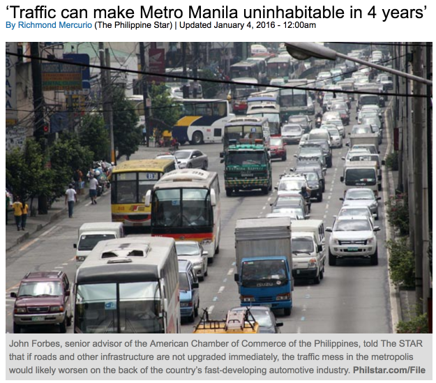

<h1>A day on the roads of Manila</h1>
<h4>As captured from thousands of rideshare trips by Open Traffic and Mapzen Tangram</h4>

Welcome to Manila, capital of the Philippines. Home to millions of people, this city is the most dense in the world by [some measures](https://en.wikipedia.org/wiki/List_of_cities_by_population_density).

Manila and its surrounding metropolitan region are also home to some of the worst traffic in the world. As summed up by a newspaper headline at the start of 2016:

<a href="http://www.philstar.com/headlines/2016/01/04/1539050/traffic-can-make-metro-manila-uninhabitable-4-years"><i class="fa fa-external-link"></i> An article from the Philippine Star.</a>

Congestion like this is a profound limitation on the economy and the health of Manila. The World Bank [estimates](http://blogs.worldbank.org/eastasiapacific/philippines-traffic-woes-and-road-ahead) that as a result of its poor transportation network, Manila lost $18 billion in productivity, "an amount enough to fully plug underinvestment in infrastructure, education, and health." Manila also has poor air quality, in large part a result of all these vehicles. The Philippines is ranked as the 10th worst country in terms of deaths caused by air pollution, according to World Bank [findings](http://documents.worldbank.org/curated/en/984261468327002120/Transport-for-health-the-global-burden-of-disease-from-motorized-road-transport).

And while harder to capture in statistics, when people are unable to get around, they can't visit their relatives as often, connect with their friends, and find amusement and opportunity.

<h4>What's to be done?</h4>

Transportation networks are

http://www.worldbank.org/en/news/press-release/2014/09/26/philippines-world-bank-approves-financing-for-safe-reliable-and-affordable-transport-in-metro-cebu

<h4>What's on this map?</h4>

Open Traffic

(World Bank, Mapzen, Grab)

link to blog post on mapzen.com about Open Traffic

** 6:30am **

The day start calm and quiet

&#8232;

&#8232;

&#8232;

&#8232;

&#8232;

&#8232;

&#8232;

&#8232;

&#8232;

&#8232;

&#8232;

&#8232;

&#8232;

&#8232;

&#8232;

&#8232;

&#8232;
Looking closer...

... we can see the highways flowing normally with early commuters

&#8232;

&#8232;

&#8232;

&#8232;

&#8232;

&#8232;

&#8232;

&#8232;

&#8232;

&#8232;

&#8232;

&#8232;

&#8232;

&#8232;

&#8232;

&#8232;

&#8232;

By 8:30 the streets are getting bussy with some ocational traffic 

&#8232;

&#8232;

&#8232;

&#8232;

&#8232;

&#8232;

&#8232;

&#8232;

&#8232;

&#8232;

&#8232;

&#8232;

&#8232;

&#8232;

&#8232;

&#8232;

&#8232;

here 

&#8232;

&#8232;

&#8232;

&#8232;

&#8232;

&#8232;

&#8232;

&#8232;

&#8232;

&#8232;

&#8232;

&#8232;

&#8232;

&#8232;

&#8232;

&#8232;

&#8232;

and there

&#8232;

&#8232;

&#8232;

&#8232;

&#8232;

&#8232;

&#8232;

&#8232;

&#8232;

&#8232;

&#8232;

&#8232;

&#8232;

&#8232;

&#8232;

&#8232;

&#8232;

Then we see the normal traffic of a week day

&#8232;

&#8232;

&#8232;

&#8232;

&#8232;

&#8232;

&#8232;

&#8232;

&#8232;

&#8232;

&#8232;

&#8232;

&#8232;

&#8232;

&#8232;

&#8232;

&#8232;

** 12pm **

&#8232;

&#8232;

&#8232;

&#8232;

&#8232;

&#8232;

&#8232;

&#8232;

&#8232;

&#8232;

&#8232;

&#8232;

&#8232;

&#8232;

&#8232;

&#8232;

&#8232;

** 1pm **

&#8232;

&#8232;

&#8232;

&#8232;

&#8232;

&#8232;

&#8232;

&#8232;

&#8232;

&#8232;

&#8232;

&#8232;

&#8232;

&#8232;

&#8232;

&#8232;

&#8232;

** 2pm **

&#8232;

&#8232;

&#8232;

&#8232;

&#8232;

&#8232;

&#8232;

&#8232;

&#8232;

&#8232;

&#8232;

&#8232;

&#8232;

&#8232;

&#8232;

&#8232;

&#8232;

** 3pm **

&#8232;

&#8232;

&#8232;

&#8232;

&#8232;

&#8232;

&#8232;

&#8232;

&#8232;

&#8232;

&#8232;

&#8232;

&#8232;

&#8232;

&#8232;

&#8232;

&#8232;
** 4pm **

&#8232;

&#8232;

&#8232;

&#8232;

&#8232;

&#8232;

&#8232;

&#8232;

&#8232;

&#8232;

&#8232;

&#8232;

&#8232;

&#8232;

&#8232;

&#8232;

&#8232;

** 5pm **

&#8232;

&#8232;

&#8232;

&#8232;

&#8232;

&#8232;

&#8232;

&#8232;

&#8232;

&#8232;

&#8232;

&#8232;

&#8232;

&#8232;

&#8232;

&#8232;

&#8232;

** 6pm **

&#8232;

&#8232;

&#8232;

&#8232;

&#8232;

&#8232;

&#8232;

&#8232;

&#8232;

&#8232;

&#8232;

&#8232;

&#8232;

&#8232;

&#8232;

&#8232;

&#8232;

** 7pm **

&#8232;

&#8232;

&#8232;

&#8232;

&#8232;

&#8232;

&#8232;

&#8232;

&#8232;

&#8232;

&#8232;

&#8232;

&#8232;

&#8232;

&#8232;

&#8232;

&#8232;

By ** 8pm ** we see the heavy traffic of friday rush hour

&#8232;

&#8232;

&#8232;

&#8232;

&#8232;

&#8232;

&#8232;

&#8232;

&#8232;

&#8232;

&#8232;

&#8232;

&#8232;

&#8232;

&#8232;

&#8232;

&#8232;

This main highway is jammed from here

&#8232;

&#8232;

&#8232;

&#8232;

&#8232;

&#8232;

&#8232;

&#8232;

&#8232;

&#8232;

&#8232;

&#8232;

&#8232;

&#8232;

&#8232;

&#8232;

&#8232;

&#8232;

&#8232;

&#8232;

&#8232;

&#8232;

&#8232;

&#8232;

&#8232;

&#8232;

&#8232;

&#8232;

&#8232;

&#8232;

&#8232;

&#8232;

&#8232;

&#8232;

&#8232;

&#8232;

&#8232;

&#8232;

&#8232;

&#8232;

&#8232;

&#8232;

&#8232;

&#8232;

&#8232;

&#8232;

&#8232;

&#8232;

&#8232;

&#8232;

&#8232;

Imagine the painfull ride

&#8232;

&#8232;

&#8232;

&#8232;

&#8232;

&#8232;

&#8232;

&#8232;

&#8232;

&#8232;

&#8232;

&#8232;

&#8232;

&#8232;

&#8232;

&#8232;

** 1pm **

&#8232;

&#8232;

&#8232;

&#8232;

&#8232;

&#8232;

&#8232;

&#8232;

&#8232;

&#8232;

&#8232;

&#8232;

&#8232;

&#8232;

&#8232;

&#8232;

** 10pm **

&#8232;

&#8232;

&#8232;

&#8232;

&#8232;

&#8232;

&#8232;

&#8232;

&#8232;

&#8232;

&#8232;

&#8232;

&#8232;

&#8232;

&#8232;

&#8232;

**Manila from far away**

&#8232;

&#8232;

&#8232;

&#8232;

&#8232;

&#8232;

&#8232;

&#8232;

&#8232;

&#8232;

&#8232;

&#8232;

&#8232;

&#8232;

&#8232;

&#8232;

**Jones Bridge**

&#8232;

&#8232;

&#8232;

&#8232;

&#8232;

&#8232;

&#8232;

&#8232;

&#8232;

&#8232;

&#8232;

&#8232;

&#8232;

&#8232;

&#8232;

&#8232;

**Paco park**

&#8232;

&#8232;

&#8232;

&#8232;

&#8232;

&#8232;

&#8232;

&#8232;

&#8232;

&#8232;

&#8232;

&#8232;

&#8232;

&#8232;

&#8232;

&#8232;

** 7am **

&#8232;

&#8232;

&#8232;

&#8232;

&#8232;

&#8232;

&#8232;

&#8232;

&#8232;

&#8232;

&#8232;

&#8232;

&#8232;

&#8232;

&#8232;

&#8232;

**Anda Circle**

&#8232;

&#8232;

&#8232;

&#8232;

&#8232;

&#8232;

&#8232;

&#8232;

&#8232;

&#8232;

&#8232;

&#8232;

&#8232;

&#8232;

&#8232;

&#8232;

**Buendia and Sergio Osmena Highway**

&#8232;

&#8232;

&#8232;

&#8232;

&#8232;

&#8232;

&#8232;

&#8232;

&#8232;

&#8232;

&#8232;

&#8232;

&#8232;

&#8232;

&#8232;

&#8232;

**EDSA by Makati area, below Pasig River**

&#8232;

&#8232;

&#8232;

&#8232;

&#8232;

&#8232;

&#8232;

&#8232;

&#8232;

&#8232;

&#8232;

&#8232;

&#8232;

&#8232;

&#8232;

&#8232;

**EDSA Mandaluyong area**

&#8232;

&#8232;

&#8232;

&#8232;

&#8232;

&#8232;

&#8232;

&#8232;

&#8232;

&#8232;

&#8232;

&#8232;

&#8232;

&#8232;

&#8232;

&#8232;

**EDSA Greenhills area**

&#8232;

&#8232;

&#8232;

&#8232;

&#8232;

&#8232;

&#8232;

&#8232;

&#8232;

&#8232;

&#8232;

&#8232;

&#8232;

&#8232;

&#8232;

&#8232;

**EDSA and Aurora Blvd Quezon City area**

<h4>Credits</h4>

<h4>For More Information</h4>

opentraffic.io

https://mapzen.com/blog/speed-tiles/

https://mapzen.com/products/tangram
