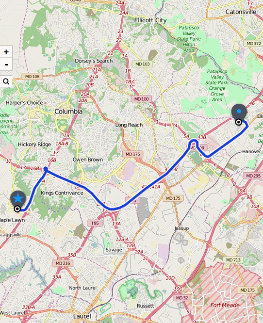
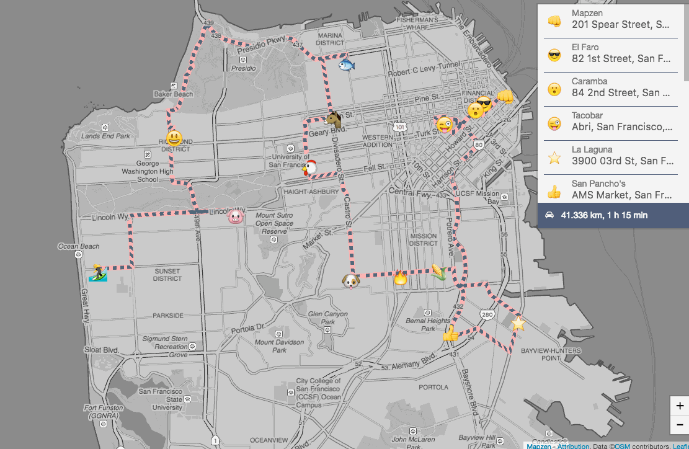
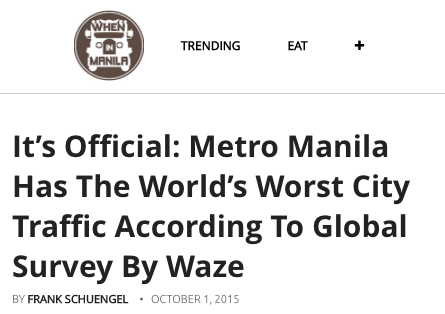

<h1>A day on the roads of Manila</h1>

Mapzen, the World Bank, Grab, Conveyal, and [more partners](#credits) have teamed up to help Manila and other major cities around the world understand and improve their transportation challenges. Together we're creating Open Traffic, a data platform to map flows of movement through cities. Into the platform go anonymous data from rideshare vehicles and smartphones, out of the platform comes maps like this.

This is traffic in Manila on Friday, August 5, 2015. Drag the slider to advance through the day. Pan and zoom the map to explore the city. Traffic is light on teal roadways; it's sluggish on maroon roadways.

Or continue on to read more about transportation in Manila and what we're aiming to accomplish together with Open Traffic. As you scroll down through this story, the map will advance to places and times mentioned in blue. 

Welcome to Manila. Home to millions of people, it's the capital of the Philippines and the [most dense city in the world](https://en.wikipedia.org/wiki/List_of_cities_by_population_density).

Manila and its surrounding metropolitan region are also home to some of the worst traffic in the world. As summed up by that newspaper headline at the start of 2016: "Traffic can make Metro Manila uninhabitable in 4 years"!

Congestion like this is a profound limitation on the economy and the health of all in Manila. The World Bank [estimates](http://blogs.worldbank.org/eastasiapacific/philippines-traffic-woes-and-road-ahead) that as a result of its poor transportation network, Manila lost $18 billion in productivity, "an amount enough to fully plug underinvestment in infrastructure, education, and health." Manila also has poor air quality, in large part a result of vehicles on roads. The Philippines is ranked as the 10th worst country in terms of deaths caused by airborne pollution, according to World Bank [findings](http://documents.worldbank.org/curated/en/984261468327002120/Transport-for-health-the-global-burden-of-disease-from-motorized-road-transport).

The personal impact of Manila's limited transportation options are most vividly illustrated by "Carmagedon" days. Twice in the last two years, flooding has brought the city to a halt. "I left the office on Sept 8, I arrived home on Sept. 9," says a commuter [quoted](http://newsinfo.inquirer.net/720807/flash-floods-trigger-metro-carmaggedon) by the Philippine Daily Inquirer during 2015's Carmagedon.

<h4>Building the transportation network Manila deserves</h4>

Manila deserves a transportation network that is dependable and makes the city accessible to all. Cars are part of this mix. Also mass-transit options (like trains, buses, and subways), non-motorized options (like walking and biking), and new forms of software-enabled mobility (like ridesharing). Creating such a mixed and interconnected system requires cooperation among many in government, business, and civil society. It also requires analysis and planning that captures the whole of how people currently move and where infrastructure improvements can provide benefits that ripple out to the entire region.

Here's one example of a targeted improvement: The Philippine government and the World Bank [jointly funded](http://www.worldbank.org/en/news/press-release/2014/09/26/philippines-world-bank-approves-financing-for-safe-reliable-and-affordable-transport-in-metro-cebu) the creation of this bus-rapid transit line in Cebu City, another bursting Philippine city.

Buses run their own dedicated lanes, so they can speed past gridlocked traffic. They stop at station platforms along the way, to speed the boarding of riders. It's an above-ground subway, in effect, at a fraction of the cost of digging tunnels and laying tracks.

Just this fall, the Philippine government has [begun planning](http://www.update.ph/2016/09/48-6-kilometer-brt-system-in-metro-manila-approved/9458) a bus-rapid transit system to complement the EDSA, a freeway that loops around the core of Manila as is heavily congested a peak hours.

<h4>Mapping movement and planning for the future with Open Traffic</h4>

Where exactly should bus-rapid transit lines go in Manila? How will it likely improve traffic conditions? Once it's completed and people can choose between driving and riding the bus, which should they choose as conditions change on the EDSA throughout the day? These are all questions that Open Traffic seeks to address. So, what exactly is Open Traffic?

Open Traffic is a global data platform to process anonymous positions of vehicles and smartphones into real-time and historical traffic statistics. Taxi fleets, delivery and logistics companies, rideshare operators, and transit agencies are agreeing to share the positions of their vehicles collected by GPS. Open Traffic snaps these raw positions to [OpenStreetMap](https://openstreetmap.org), a map of roads and transportation infrastructure around the world that's free and open to everyone to edit. Finally, the Open Traffic platform calculates statistics that summarize the state of transportation flows along OpenStreetMap road segments.

The statistics that come out of Open Traffic will allow transportation experts at the World Bank to evaluate plans:

In fact, the World Bank has already evaluated plans like the bus-rapid transit line in Cebu City using data from a prototype of the Open Traffic platform!

That statistics that come out of Open Traffic will also soon equip routing services like Mapzen Turn-by-Turn to help users plan journeys that avoid traffic, as shown in a [prototype](https://mapzen.com/blog/speed-tiles/) in the United States:

And the statistics that come out of Open Traffic will also soon equip services like Mapzen Optimized Route, used by delivery companies to plan the shortest way to reach all their destination. Or for a burrito conissuer to reach [as many taquerias in San Francisco as possible](https://mapzen.com/blog/optimized-route/):

<h4>Traffic data providers and consumers are better off together</h4>

From commuters stranded by flooding in Manila to gluttonous tourists in San Francisco?! This may seem like the unfortunate and typical narrative of Internet-based technology: amusement for consumers in developed nations paired with an uninformed simplification of hard realities in developing nations.

The partners coming together to create Open Traffic disagree. Cities in developed nations, San Francisco included, have transportation challenges and inequities requiring systematic solutions. Cities in the developing world, Manila included, have companies eager to sell both necessities and frivolities that depend on data about transportation options.

Collecting and calculating traffic statistics from smartphone positions in both places like the United States and the Philippines is already a solved problem. That's exactly what's done by Waze, the popular app for drivers owned by Google:

Based on its statistics, Waze reports that in some years [Manila has the worst traffic of all the regions](http://www.wheninmanila.com/its-official-metro-manila-has-the-worlds-worst-city-traffic-according-to-global-survey-by-waze/)) where it operates in the world, and in other years that [Cebu City is holder of that dubious honor](http://newsinfo.inquirer.net/815278/traffic-app-waze-names-cebu-as-worst-city-to-drive-in). But Open Traffic's goal isn't to compete with Waze, or with any of the other vendors that will sell you traffic data that they collect using cameras, radios, magnetic loops, and helicopters.

Open Traffic is designed to support as diverse a set of uses as possible. Some have commercial potential, others are civic in nature, and some may just be creative. 

For example: Mapzen is buildings products like our Turn-by-Turn routing engine and Optimized Route planner to work with Open Traffic. We wouldn't object to companies that create similar products to do the same. That's in keeping with our "[magna carto](https://mapzen.com/blog/our-magna-carto/)" and our proposition that when geodata is freely available as a commodity, software companies can focus on what actually makes their products unique and valuable.

Likewise: the World Bank has been funding the development of Open Traffic under the condition that [all software be released as open-source for free use](https://github.com/opentraffic). A full-featured prototype has been created by the transportation tech consultancy Conveyal. That system processed and created the statistics in this map. Now Mapzen is turning this prototype into a platform that handles traffic data around the globe. We're also assisted by our partners at Amazon Web Servers (to scale server operations), CARTO (to connect with geospatial and business intelligence tooling), and Cornell Tech (to ensure that Open Traffic protects the privacy of all individuals and the confidential aspects of fleet operations).

And most importantly: Grab and the other organizations and individuals consenting to contribute their anonymous location information are doing so because they'll be able to derive their own value from having access to traffic-influenced routing and other analysis services.

Like a transportation network, that must be designed to allow many different users to reach their own destinations, the Open Traffic platform is designed to support both data contributors and consumers in pursuit of their own goals.

<h4>For more information</h4>

- [Sign up for the Open Traffic newsletter](http://opentraffic.us14.list-manage.com/subscribe?u=0e6adfcd7ba2f8404e6ea92bc&id=8ab8b0910a) to follow the progress of the platform and the growth of the partner network.

- [Sign up for Mapzen's newsletter](https://mapzen.com/newsletter-signup/) to also hear more about related products that we're building on top Open Traffic data.

- [Learn more about Mapzen Tangram](https://mapzen.com/products/tangram), the 3D rendering engine used to create this map.

- [View the code](https://github.com/mapzen/open-traffic-poc-data-demo) used to load data into Mapzen Tangram.

<h4>Credits</h4>

- TODO
- TODO
<!--

<a href="http://www.philstar.com/headlines/2016/01/04/1539050/traffic-can-make-metro-manila-uninhabitable-4-years"><i class="fa fa-external-link"></i> An article from the Philippine Star.</a>

https://en.wikipedia.org/wiki/Cebu_Bus_Rapid_Transit_System#/media/File:Osmena_Blvd_Artists_Impression.jpg
-->